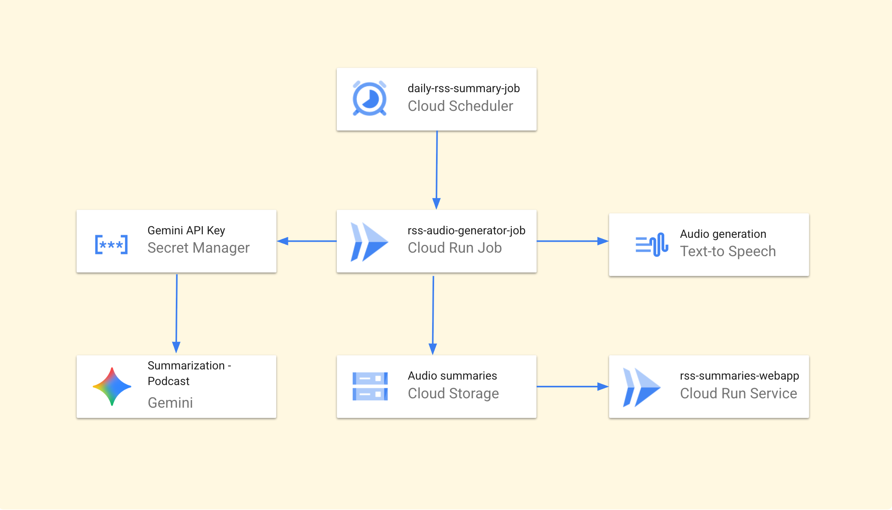

# AI News Audio Briefing

This is a demo application that converts AI news articles into audio briefings. The project demonstrates how to build an automated pipeline using Google Cloud services, including Gemini 2.5 Pro for content summarization and Cloud Text-to-Speech for audio generation.

The application uses Cloud Run Job for content processing and Cloud Run Service for the web interface. It fetches RSS feeds, creates summaries, and generates audio files for demonstration purposes.

## Architecture Diagram



## Features

### Content Processing
- Summarizes RSS feeds from AI news sources using Gemini 2.5 Pro
- Processes multiple RSS feeds and selects recent articles
- Converts technical articles to conversational summaries

### Audio Generation
- Converts summaries to MP3 audio files using Google Cloud Text-to-Speech
- Combines intro, content segments, and outro into complete episodes
- Generates standard MP3 files for web playback

### Infrastructure
- Cloud Run Job handles batch processing (2 CPU, 2GB memory, 1-hour timeout)
- Cloud Run Service provides web interface for listening to episodes
- Cloud Scheduler triggers daily processing at 6 AM Europe/Rome time
- Terraform configuration for deployment

### Access Control
- Optional IAP authentication via email allowlist
- Private GCS storage with signed URLs for audio file access
- Service accounts with minimal required permissions

## Project Structure

```
/
├── job/
│   ├── main.py         # The backend Cloud Run Job logic
│   ├── Dockerfile      # Container definition for the job
│   └── requirements.txt  # Python dependencies for the job
│
├── webapp/
│   ├── main.py         # The frontend Cloud Run Service logic
│   ├── Dockerfile      # Container definition for the service
│   └── requirements.txt  # Python dependencies for the service
│
├── terraform/
│   ├── main.tf         # Terraform configuration for the entire stack
│   └── ...             # Other Terraform files
│
└── README.md           # This file
```

---

## Cloud Deployment Guide

This demo application can be deployed using the provided Terraform configuration.

### Prerequisites

1.  [Terraform CLI](https://learn.hashicorp.com/tutorials/terraform/install-cli) installed.
2.  [Google Cloud CLI](https://cloud.google.com/sdk/docs/install) installed and authenticated (`gcloud auth application-default login`).
3.  A Google Cloud project with billing enabled.
4.  Permissions to enable APIs and create all the resources defined in the Terraform configuration (e.g., `Owner` or `Editor` roles).

### Deployment Steps

1.  **Navigate to the Terraform Directory:**
    ```bash
    cd terraform
    ```

2.  **Create a `terraform.tfvars` file:**
    This is the most secure way to provide your project-specific variables. Create the file and add the following content, replacing the placeholder values:
    ```hcl
    project_id      = "your-gcp-project-id"
    gcs_bucket_name = "your-globally-unique-bucket-name"
    gemini_api_key  = "your-gemini-api-key"
    
    # Optional: Enable IAP authentication (leave empty for public access)
    iap_allowed_emails = []
    # iap_allowed_emails = ["admin@yourcompany.com"] # Uncomment to enable auth
    ```

3.  **Initialize Terraform:**
    This command downloads the necessary provider plugins.
    ```bash
    terraform init
    ```

4.  **Plan the Deployment:**
    This command shows you what resources will be created. It's a dry run and is safe to run.
    ```bash
    terraform plan
    ```

5.  **Apply the Configuration:**
    This command builds the container images and deploys the cloud resources.
    ```bash
    terraform apply
    ```
    Terraform will ask for confirmation. Type `yes` to proceed. The deployment will take several minutes.

6.  **Access the Application:**
    Once complete, Terraform will output the URL of the web application. If IAP is enabled, users will authenticate with Google before accessing the app.

## Deploying Application Updates

If you only need to update the application code for the backend job or the frontend web app, you do not need to re-run `terraform apply`. You can deploy updates directly using the `gcloud` CLI.

### Updating the Backend Job (`rss-audio-generator-job`)

After making changes to the code in the `job/` directory:

```bash
gcloud run jobs deploy rss-audio-generator-job \
    --source=./job \
    --project=<YOUR_PROJECT_ID> \
    --region=europe-west1 
```

### Updating the Frontend Web App (`rss-summaries-webapp`)

After making changes to the code in the `webapp/` directory:

```bash
gcloud run deploy rss-summaries-webapp \
    --source=./webapp \
    --project=<YOUR_PROJECT_ID> \
    --region=europe-west1
```

---

## Local Testing


### Testing the Web App

The web application can be tested locally, but it requires you to have a GCS bucket with audio files already in it.

1.  **Navigate to the webapp directory:**
    ```bash
    cd webapp
    ```
2.  **Activate a virtual environment:**
    ```bash
    python3 -m venv venv && source venv/bin/activate
    pip install -r requirements.txt
    ```
3.  **Authenticate to Google Cloud:**
    ```bash
    gcloud auth application-default login
    ```
4.  **Set Environment Variables:**
    ```bash
    export GCS_BUCKET_NAME="<YOUR_GCS_BUCKET_NAME>"
    ```
5.  **Set Additional Environment Variables (for signed URLs):**
    ```bash
    export SERVICE_ACCOUNT_EMAIL="<YOUR_WEBAPP_SERVICE_ACCOUNT_EMAIL>"
    ```

6.  **Run the Flask App:**
    ```bash
    flask --app main run
    ```
    You can now access the web app at `http://127.0.0.1:5000`.

### Testing the Backend Job

The backend job is designed to run in the cloud and relies on the Cloud Run environment's service account and metadata server. Therefore, **local testing of the job is not recommended**. The most reliable way to test it is to trigger it in the cloud after deployment.
